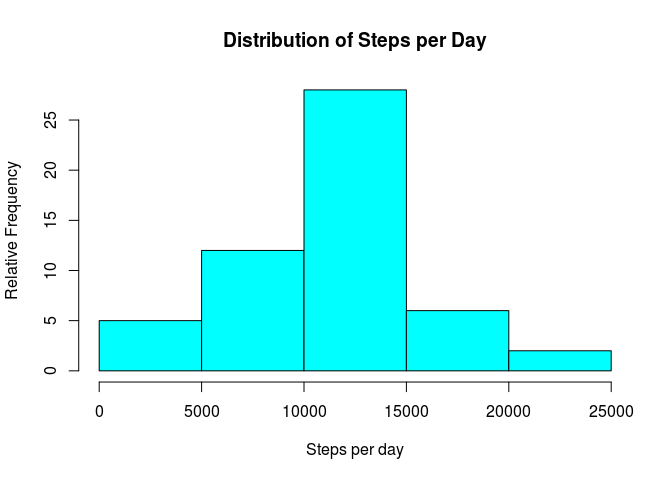
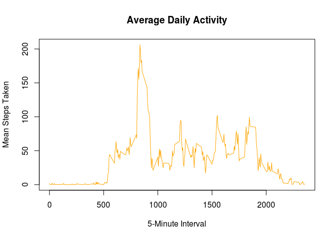
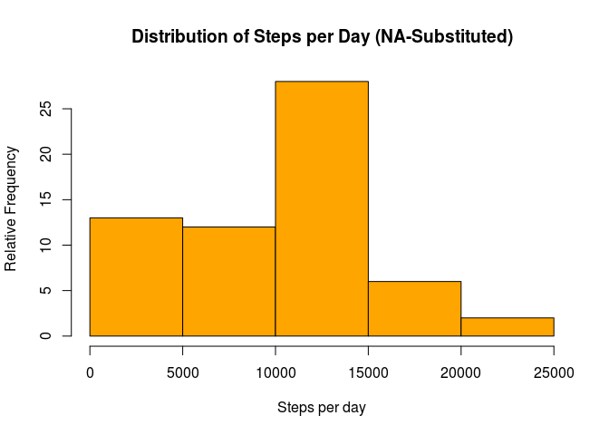
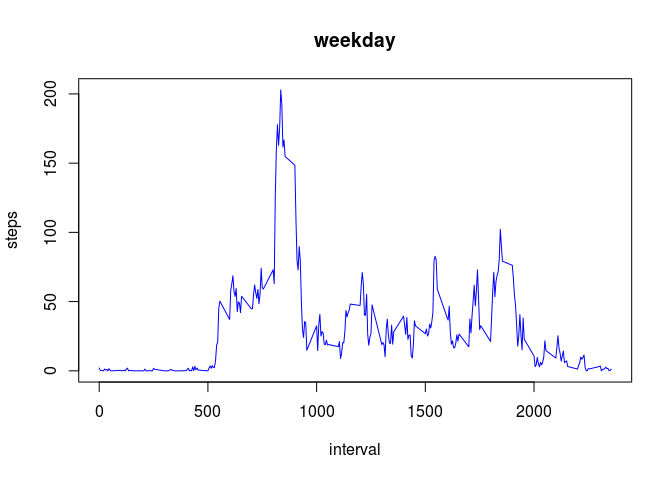
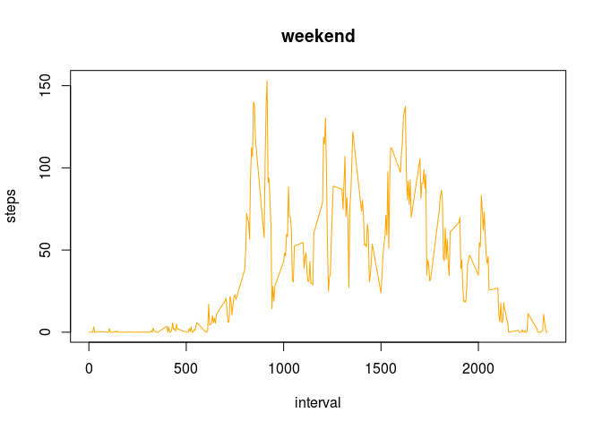

# Reproducible Research: Peer Assessment 1
Adam L. Seale - TenthSpeedWriter  
May 13, 2016  


## Loading and preprocessing the data
In loading our data we shall use the lubridate package to convert the date string into a valid date-handling object, then append a column titled "weekday" with the corresponding output of weekdays(ymd(date)).

```r
library(dplyr)
```

```
## 
## Attaching package: 'dplyr'
```

```
## The following objects are masked from 'package:stats':
## 
##     filter, lag
```

```
## The following objects are masked from 'package:base':
## 
##     intersect, setdiff, setequal, union
```

```r
library(lubridate)

raw_data <- read.csv("activity.csv")
activity <- (raw_data %>% mutate(date = ymd(date),
                                 weekday = weekdays(date)))
```


## What is mean total number of steps taken per day?
To calculate this value we shall first take the sum of steps for each day on record, then take the mean and median across all days.

```r
steps_per_day <- (activity
                  %>% group_by(date)
                  %>% summarise(total_steps = sum(steps)))
```
### Median steps per day:

```r
median(steps_per_day$total_steps,
       na.rm = T)
```

```
## [1] 10765
```

### Mean steps per day:

```r
mean(steps_per_day$total_steps,
     na.rm = T)
```

```
## [1] 10766.19
```

### Visualization

```r
hist(x=steps_per_day$total_steps,
     
     main="Distribution of Steps per Day",
     xlab="Steps per day",
     ylab="Relative Frequency",
     
     col="cyan")
```

<!-- -->


## What is the average daily activity pattern?
To answer this question, let us first extract the mean values across all days for each interval, ignoring missing values.

```r
mean_at_interval <- (activity
                     %>% group_by(interval)
                     %>% summarise(mean_steps = mean(steps,
                                                     na.rm = T)))
```

### Visualization of Activity Patterns

```r
plot(mean_at_interval$mean_steps ~ mean_at_interval$interval,
     
     main="Average Daily Activity",
     xlab="5-Minute Interval",
     ylab="Mean Steps Taken",
     
     type="l",
     col="orange")
```

<!-- -->


### Maximum Number of Steps:
The interval with the highest average step count, neglecting any ties, is:

```r
greatest_num_of_steps <- max(mean_at_interval$mean_steps)
interval_with_most_steps <- filter(mean_at_interval, mean_steps == greatest_num_of_steps)[[1, 'interval']]

interval_with_most_steps
```

```
## [1] 835
```


## Imputing missing values

### Number of Missing Values
We shall first analyze the number of rows with absent values in our dataset:

```r
sum(as.integer(is.na(activity$steps)))
```

```
## [1] 2304
```

### Replacing Missing Malues
In order to smooth our data, we shall take the average number of steps for each interval on each given weekday and substitue these means for corresponding missing values in the dataset.

```r
mean_for_interval_on_day <- (activity
                             %>% group_by(interval, weekday)
                             %>% summarise(steps = mean(steps,
                                                        na.rm = T)))
step_mean_if_na <- function(row_num) {
  row <- activity[row_num, ]
  
  if(is.na(row$steps)) {
    filter(mean_for_interval_on_day,
           interval == interval,
           weekday == weekday)[1, 3] %>% as.numeric
  } else {
    row$steps %>% as.numeric
  }
}

rows_in_activity <- 1:nrow(activity)
steps_with_estimations <- sapply(rows_in_activity,
                                 step_mean_if_na)
activity_with_estimations <- mutate(activity,
                                    steps=steps_with_estimations)
```

### Histogram of Estimate-filled Steps per Day


```r
steps_per_day_with_estimates <- (data.frame(activity_with_estimations)
                                 %>% group_by(date)
                                 %>% summarise(total_steps = sum(steps)))
hist(x=steps_per_day_with_estimates$total_steps,
     
     main="Distribution of Steps per Day (NA-Substituted)",
     xlab="Steps per day",
     ylab="Relative Frequency",
     
     col="orange")
```

<!-- -->

### Statistical Comparison to Original Values

```r
median(steps_per_day$total_steps,
       na.rm = T)
```

```
## [1] 10765
```

```r
mean(steps_per_day$total_steps,
     na.rm = T)
```

```
## [1] 10766.19
```


## Are there differences in activity patterns between weekdays and weekends?

To analyze this, we shall compare the average values for all work days against that of both weekend days.


```r
weekend_days <- c("Saturday", "Sunday")

activity_by_day_type <- (activity_with_estimations
                         %>% mutate(day_type = as.factor(weekday %in% weekend_days)))
levels(activity_by_day_type$day_type) <- c("weekday", "weekend")

interval_means_by_day_type <- (activity_by_day_type
                               %>% group_by(day_type, interval)
                               %>% summarise(steps = mean(steps)))

plot_interval_means <- function(x_day_type) {
  data <- filter(interval_means_by_day_type,
                 as.character(day_type) == x_day_type)
  plot(x=data$interval,
       y=data$steps,
       type="l",
       
       main=x_day_type,
       xlab="interval",
       ylab="steps",
       
       col=list(weekday="blue",
                weekend="orange")[[x_day_type]])
}
plot_interval_means("weekday")
```

<!-- -->

```r
plot_interval_means("weekend")
```

<!-- -->

